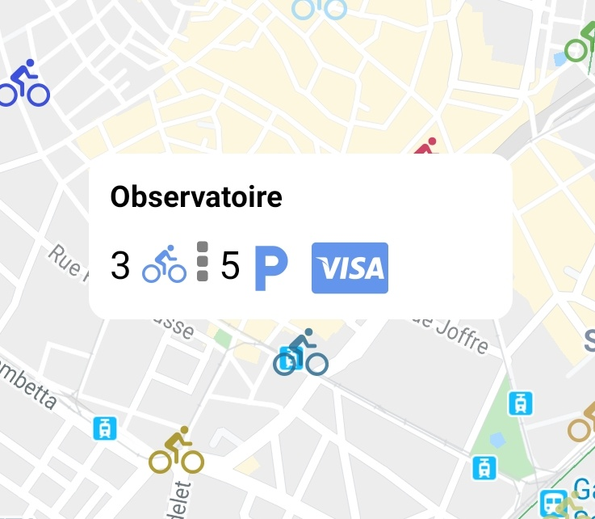

# veloMaggPark

<kbd>
  
</kbd>

Where should you let your bike from Tam in Montpellier

You have an option in the official app of the Tam Montpellier, it's a personal experience to improve my skill with this kind of application.

* You will retrieve a lot of marker (colored bikes) where you can tap on any bike to view his information (bike remaining, place available, credit card support.)

* If you accept to get your location, the map will show you with blue dot.

Build:
* Android : OK.
* IOS: Almost done, as soon as I have the time I buy a macbook to create an .IPA

If you want to build the app in APK/IOS : You will need write the command from the react native documentation to build an app. (./gradlew AssembleRelease and so on..)

# Navigation through the app

# Take a zoom to our custom popup for better UI/UX
 

# Installation
(yarn works as well)
* sudo npm i.
* sudo react-native start.
* sudo react-native run-android(or ios but not yet works).
