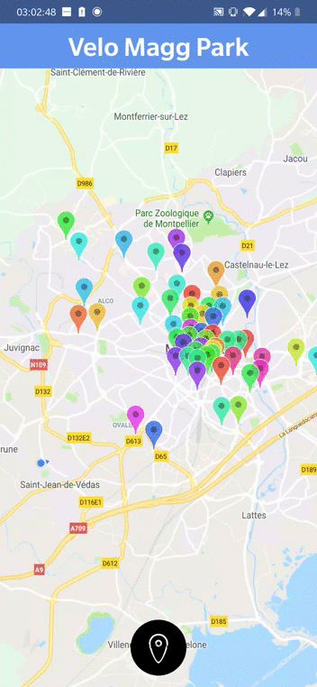

# veloMaggPark
Where should you let your bike from Tam in Montpellier

You have an option in the official app of the Tam Montpellier, it's a personal experience to improve my skill with this king of application.

* You have all flags in color which show a park of Velo mag, you can tap on any flag to view his information (places available, cb available and so on..)

* You have also a button which zoom on your localization to watch the parks around you.

Build:
* Android : OK.
* IOS: Almost done, I have a little problem when I want to get the xml data.

If you want to build the app in APK/IOS : You will need to have expo in your computer and run expo build:android or expo build:ios

# Few functionality

# Installation

* sudo npm i
* sudo npm start
